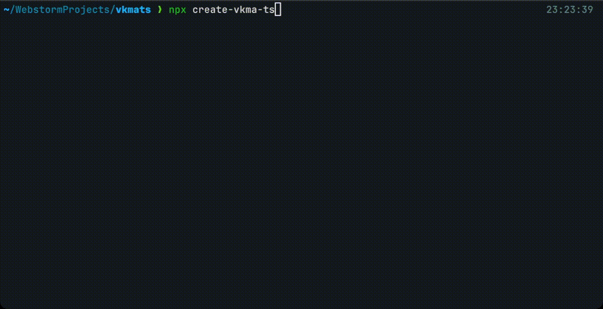

# Create VK Mini App with TypeScript [![npm][npm]][npm-url]

### Zero-config CLI generator for TypeScript VK mini app development.



## How to use

### With NPX

```bash
npx @tap_team/create-vkma-ts@latest
```

## How to start work with app

Go to created folder and run:  
`yarn start` or `npm start` to start dev server with hot reload on `localhost:10888`.

`yarn run build` or `npm run build` to build production bundle, with tree-shaking, uglify and all this modern fancy stuff.


## Generated project dependencies

| Dependencies                  | Version |              Is Dev              |             Optional             |
|:------------------------------|:-------:|:--------------------------------:|:--------------------------------:|
| @types/jest                   | 29.2.4  |    <input type="checkbox" />     |    <input type="checkbox" />     |
| @types/node                   | 17.0.45 |    <input type="checkbox" />     |    <input type="checkbox" />     |
| @types/react                  | 17.0.52 |    <input type="checkbox" />     |    <input type="checkbox" />     |
| @types/react-dom              | 17.0.18 |    <input type="checkbox" />     |    <input type="checkbox" />     |
| @vitejs/plugin-react          | ^3.0.0  |    <input type="checkbox" />     |    <input type="checkbox" />     |
| @vkontakte/icons              | 2.14.0  |    <input type="checkbox" />     |    <input type="checkbox" />     |
| @vkontakte/vk-bridge          |  2.7.2  |    <input type="checkbox" />     |    <input type="checkbox" />     |
| @vkontakte/vk-miniapps-deploy | 0.0.26  |    <input type="checkbox" />     |    <input type="checkbox" />     |
| @vkontakte/vkjs               | 0.31.0  |    <input type="checkbox" />     |    <input type="checkbox" />     |
| @vkontakte/vkui               |  5.1.0  |    <input type="checkbox" />     |    <input type="checkbox" />     |
| react                         | ^17.0.0 |    <input type="checkbox" />     |    <input type="checkbox" />     |
| react-dom                     | ^17.0.0 |    <input type="checkbox" />     |    <input type="checkbox" />     |
| rollup                        | ^3.7.5  |    <input type="checkbox" />     |    <input type="checkbox" />     |
| vite                          | ^4.0.2  |    <input type="checkbox" />     |    <input type="checkbox" />     |
| vite-plugin-singlefile        | ^0.13.2 |    <input type="checkbox" />     |    <input type="checkbox" />     |
| recoil                        |  0.7.6  |    <input type="checkbox" />     | <input type="checkbox" checked/> |
| @happysanta/router            |  0.3.1  |    <input type="checkbox" />     | <input type="checkbox" checked/> |
| @happysanta/bridge-plus       | 0.0.24  |    <input type="checkbox" />     | <input type="checkbox" checked/> |
| @babel/eslint-parser          | ^7.18.9 | <input type="checkbox" checked/> |    <input type="checkbox" />     |
| @babel/preset-react           | ^7.18.6 | <input type="checkbox" checked/> |    <input type="checkbox" />     |
| cross-env                     | ^7.0.3  | <input type="checkbox" checked/> |    <input type="checkbox" />     |
| react-hot-loader              | ^4.13.0 | <input type="checkbox" checked/> |    <input type="checkbox" />     |
| typescript                    | ^4.8.3  | <input type="checkbox" checked/> |    <input type="checkbox" />     |
| react-scripts                 | ^4.0.3  | <input type="checkbox" checked/> | <input type="checkbox" checked/> |
| eruda                         |  2.8.3  | <input type="checkbox" checked/> | <input type="checkbox" checked/> |
| eruda-dom                     |  2.0.0  | <input type="checkbox" checked/> | <input type="checkbox" checked/> |
| husky                         | ^8.0.3  | <input type="checkbox" checked/> | <input type="checkbox" checked/> |
| lint-staged                   | ^13.1.0 | <input type="checkbox" checked/> | <input type="checkbox" checked/> |
| prettier                      | ^2.8.3  | <input type="checkbox" checked/> | <input type="checkbox" checked/> |


[npm]: https://img.shields.io/npm/v/@tap_team/create-vkma-ts.svg
[npm-url]: https://npmjs.com/package/@tap_team/create-vkma-ts
